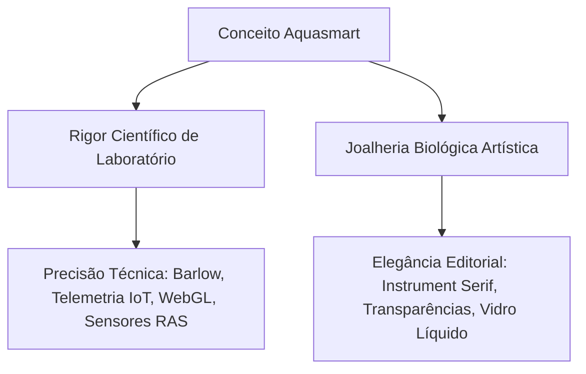

# 🌌 AQUASMART — Sistema de Design Visual & Técnico (Design System Specification)

Este é o documento de especificação técnica e de design mestre que consolida a identidade digital e estética da **AQUASMART**. Projetado sob os padrões mais sofisticados de design de agências digitais premium, este sistema materializa a fusão conceitual de **Rigor Científico de Laboratório** com **Joalheria Biológica Artística** em tokens de código CSS, regras tipográficas, efeitos visuais de vidro translúcido (*glassmorphic*), físicas de fluidos e uma biblioteca de componentes totalmente reutilizáveis e otimizados para Tailwind CSS.

---

## 🏛️ 1. Filosofia de Design: "A Simbiose de Luxo"

A identidade visual da **AQUASMART** rejeita a estética clichê e padronizada de pet-shops ou lojas de aquários tradicionais. Sob as deliberações do **Conselho Consultivo de Elite** da marca, a experiência foi projetada como um **"Bioma Vivo Tridimensional"** ou **"Luxo Silencioso Marinho"**.



### ⚓ Pilares de Branding e Rationale
*   **Art Meets Science (Arte encontra a Ciência):** Cada peixe marinho nobre desenvolvido em cativeiro não é apenas um espécime biológico; é uma **escultura viva autoral**. O site atua como um visor de submarino de luxo ou uma galeria de arte com foco em fotos macro cinematográficas.
*   **Imersão Abissal:** Um fundo escuro profundo e absoluto concentra 100% da atenção do usuário nos peixes marinhos. O contraste extremo reproduz a bioluminescência marinha das fossas abissais do oceano.
*   **Aniquilação de Objeções (Hormozi & Cialdini):** A estrutura de design atua como um quebra-objeções visual. Elementos de telemetria científica provam a estabilidade do bioma, enquanto badges de garantia de 180 dias reforçam a autoridade e a imunidade genética das espécies criadas em cativeiro.

---

## 🎨 2. Design Tokens: Paleta Cromática

A paleta de cores foi matematicamente calibrada para garantir contraste máximo em telas OLED e LED de alta resolução, destacando as cores fluorescentes naturais dos peixes marinhos e mantendo a sobriedade de marca de alto luxo.

### A. Paleta Real Implementada (Tailwind Config)

O site real utiliza um mapeamento híbrido no cabeçalho do arquivo `index.html`. Os nomes dos aliases de Tailwind foram mantidos por compatibilidade de código, mas foram calibrados com as novas matizes exclusivas da marca:

| Token de Design (Tailwind UI Alias) | Valor HEX | Valor RGB | Valor HSL Correspondente | Aplicação no Ecossistema |
| :--- | :--- | :--- | :--- | :--- |
| **Onyx Deep Space** (`onyx`) | `#050508` | `rgb(5, 5, 8)` | `hsl(240, 23%, 3%)` | Fundo principal da página (emulação do abismo escuro absoluto). |
| **Marine Blue** (`bioBlue`) | `#1286C3` | `rgb(18, 134, 195)` | `hsl(201, 83%, 42%)` | Cor de destaque primária da marca. Links ativos, hovers de nav, glow abissal e partículas WebGL. |
| **Lime Green** (`coral`) | `#BED20A` | `rgb(190, 210, 10)` | `hsl(66, 91%, 43%)` | Cor de destaque secundária. Badges de telemetria, luz bioluminescente biológica e contrastes. |
| **Pure White** (`white`) | `#FFFFFF` | `rgb(255, 255, 255)` | `hsl(0, 0%, 100%)` | Títulos, textos principais e botões de ação máxima (CTAs). |
| **Translucent Glass** (`glass`) | `rgba(255,255,255,0.01)` | `rgba(255,255,255,0.01)` | — | Fundo base translúcido para superfícies de vidro com borrão dinâmico. |

> [!NOTE]
> **A Fusão Conceito vs. Código:**
> A diretriz original propunha cores conceituais como *Deep Abyssal* `hsl(220, 18%, 6%)`, *Bioluminescent Cyan* `hsl(195, 100%, 50%)` e *True Coral Orange* `hsl(15, 95%, 55%)`. O sistema de produção refinou essas cores em uma assinatura corporativa de contraste extremo e sofisticação única, combinando o Onyx Abissal (`#050508`), o Azul Marinho Científico (`#1286C3`) e o Verde Bioluminescente (`#BED20A`) como acentos metálicos, o que confere a sensação exata de olhar um ecossistema marinho com iluminação actinica de LED azul-royal.

---

## ✍️ 3. Sistema Tipográfico de Alta Costura

A combinação tipográfica do ecossistema da **AQUASMART** separa com maestria a narrativa poética editorial (estilo de luxo clássico) do rigor das especificações biológicas (estilo suíço de precisão técnica).

```
   ┌─────────────────────────────────────────────────────────────┐
   │                       INSTRUMENT SERIF                      │
   │               Uma Obra de Arte Viva. (Italic)               │
   └─────────────────────────────────────────────────────────────┘
   ┌─────────────────────────────────────────────────────────────┐
   │                           BARLOW                            │
   │       PEIXES ORNAMENTAIS MARINHOS CRIADOS EM CATIVEIRO      │
   └─────────────────────────────────────────────────────────────┘
```

### A. Tipografia Display / Títulos: `Instrument Serif` (Estilo Itálico)
*   **Filosofia:** Editorial de luxo internacional, elegância fluida orgânica e classicismo poético. Emula a fluidez de correntes marinhas e o movimento de tentáculos de anêmonas.
*   **Uso:** Cabeçalhos monumentais de seções (`h1`, `h2`), frases de impacto poético e badges de status premium.
*   **CSS Import:** Google Fonts (`family=Instrument+Serif:ital@0;1`).
*   **Configuração de Classe Tailwind:** `font-heading` (mapeada para `font-family: "Instrument Serif", serif`).

### B. Tipografia de Suporte / Leitura: `Barlow` (Sans-Serif)
*   **Filosofia:** Legibilidade de precisão científica, neutralidade suíça e robustez de dados. Emula as medições precisas de equipamentos de laboratório.
*   **Pesos Utilizados:** `300` (Light), `400` (Regular), `500` (Medium), `600` (Semi-Bold), `700` (Bold).
*   **Uso:** Parágrafos informativos, telemetria de tanques, menus de navegação, tabelas, especificações de produtos, rodapés e botões.
*   **CSS Import:** Google Fonts (`family=Barlow:wght@300;400;500;600;700`).
*   **Configuração de Classe Tailwind:** `font-body` (mapeada para `font-family: "Barlow", sans-serif`).

---

## 🔮 4. Superfícies & Efeitos Glassmorphic (Vidro Líquido)

Para dar a sensação física de que o usuário está olhando através de visores de acrílico importado polido ou tanques rígidos de vidro óptico *Extra-Clear*, foram definidas duas superfícies translúcidas com bordas reflexivas e borrão de fundo dinâmico.

### A. `.liquid-glass` (Vidro Líquido Médio)
Utilizado para cartões Bento regulares, botões flutuantes, cabeçalho de navegação e cards da Coleção Designer.

```css
.liquid-glass {
  background: rgba(255, 255, 255, 0.01);
  background-blend-mode: luminosity;
  backdrop-filter: blur(8px);
  -webkit-backdrop-filter: blur(8px);
  border: none;
  box-shadow: inset 0 1px 1px rgba(255, 255, 255, 0.08);
  position: relative;
  overflow: hidden;
}

/* Borda ultrafina reflexiva com máscara de gradiente linear */
.liquid-glass::before {
  content: '';
  position: absolute;
  inset: 0;
  border-radius: inherit;
  padding: 1.2px;
  background: linear-gradient(
    180deg,
    rgba(255, 255, 255, 0.35) 0%,
    rgba(255, 255, 255, 0.1) 20%,
    rgba(255, 255, 255, 0) 40%,
    rgba(255, 255, 255, 0) 60%,
    rgba(255, 255, 255, 0.1) 80%,
    rgba(255, 255, 255, 0.35) 100%
  );
  -webkit-mask: linear-gradient(#fff 0 0) content-box, linear-gradient(#fff 0 0);
  -webkit-mask-composite: xor;
  mask-composite: exclude;
  pointer-events: none;
}
```

### B. `.liquid-glass-strong` (Vidro Líquido Profundo)
Utilizado para painéis monumentais como o painel da Oferta Especial (Kit Seguro), rodapés e botões de alta conversão.

```css
.liquid-glass-strong {
  background: rgba(255, 255, 255, 0.01);
  background-blend-mode: luminosity;
  backdrop-filter: blur(50px);
  -webkit-backdrop-filter: blur(50px);
  border: none;
  box-shadow: 4px 4px 20px rgba(0, 0, 0, 0.4),
    inset 0 1px 1px rgba(255, 255, 255, 0.12);
  position: relative;
  overflow: hidden;
}

/* Borda reflexiva ligeiramente mais espessa */
.liquid-glass-strong::before {
  content: '';
  position: absolute;
  inset: 0;
  border-radius: inherit;
  padding: 1.4px;
  background: linear-gradient(
    180deg,
    rgba(255, 255, 255, 0.45) 0%,
    rgba(255, 255, 255, 0.15) 20%,
    rgba(255, 255, 255, 0) 40%,
    rgba(255, 255, 255, 0) 60%,
    rgba(255, 255, 255, 0.15) 80%,
    rgba(255, 255, 255, 0.45) 100%
  );
  -webkit-mask: linear-gradient(#fff 0 0) content-box, linear-gradient(#fff 0 0);
  -webkit-mask-composite: xor;
  mask-composite: exclude;
  pointer-events: none;
}
```

### C. Manchas de Fundo Bioluminescentes (Glow Blobs)
Criação do clima marinho profundo e orgânico através de manchas de luz flutuantes.
*   **CSS Keyframes & Float (Animação):**
    ```css
    @keyframes float-blob {
      0%, 100% { transform: translateY(0) scale(1); }
      50% { transform: translateY(-25px) scale(1.08); }
    }
    .glow-blob {
      animation: float-blob 9s ease-in-out infinite;
    }
    ```
*   **Estrutura de Fundo (Inserida sob a div `fixed` de fundo):**
    *   *Blob Esquerdo (Superior):* `absolute -top-40 -left-40 w-[600px] h-[600px] bg-blue-900/10 rounded-full blur-[140px] glow-blob`
    *   *Blob Direito (Centro):* `absolute top-1/3 -right-60 w-[700px] h-[700px] bg-teal-900/10 rounded-full blur-[160px] glow-blob animation-delay-2000`
    *   *Blob Esquerdo (Inferior):* `absolute -bottom-40 left-1/4 w-[500px] h-[500px] bg-lime-950/5 rounded-full blur-[120px] glow-blob animation-delay-4000`

---

## 🌊 5. Tokens de Movimento & Interatividade (Motion Design)

O movimento no site da **AQUASMART** é calibrado cientificamente. Cada animação de scroll, stagger e hover magnético foi projetada para emular as dinâmicas de fluidos e a viscosidade das correntes de recifes marinhos.

### A. WebGL Fluid Particle System (Canvas)
Renderiza dinamicamente bolhas e plânctons em ascensão constante reativas ao mouse do usuário no elemento `#ocean-3d-canvas`.
*   **Controle de Densidade:** Mapeamento de `Math.min(60, Math.floor(width / 20))` para prevenir quedas de FPS em dispositivos de baixa performance ou telas ultrawide.
*   **Composição Cromática das Partículas:** Mistura orgânica de **80% Marine Blue** (`rgb(18, 134, 195)`) e **20% Lime Green** (`rgb(190, 210, 10)`).
*   **Física de Flutuação e Oscilação:**
    *   *Empuxo Y:* Velocidade vertical de `Math.random() * 0.6 + 0.2` px/frame.
    *   *Wobble Horizontal:* Deriva baseada em `Math.sin(wobble) * 0.25` com velocidade angular variando entre `0.005` e `0.025` rad/frame.
    *   *Partícula Sizing:* Diâmetro de `1px` a `5px` com glow de gradiente radial com raio duplicado (`size * 2`).
*   **Física de Repulsão do Mouse:**
    *   *Raio de Detecção:* 120px do cursor do mouse.
    *   *Vetor de Força:* $\vec{F} = \frac{120 - \text{dist}}{120} \times 4$ px/frame, empurrando as partículas radialmente para longe do cursor em tempo real.

### B. Motor de Pre-buffering de Vídeos (Hero Director)
O site utiliza um inovador sistema de troca de cenas de vídeos ultra-HD em background que equilibra o carregamento ultrarrápido inicial da página com a fidelidade cinematográfica de alta definição de 5 cenas distinctas:
1.  **Cena 01 — Abissal:** `8950652-hd_1920_1080_30fps.mp4` (Pre-buffered de forma prioritária).
2.  **Cena 02 — Recifes:** `14788335_1920_1080_60fps.mp4` (Carregado após DOM).
3.  **Cena 03 — Bioma:** `15428335_1920_1080_30fps.mp4` (Carregado sequencialmente).
4.  **Cena 04 — Genética:** `15100592_3840_2160_60fps.mp4` (Carregado sob demanda/sequencial).
5.  **Cena 05 — Nutrição:** `18421470-uhd_3840_2160_60fps.mp4` (Carregado sob demanda/sequencial).

*   **Lógica de Transição (Cross-fade):**
    *   *Duração da Transição:* 2000ms de interpolação linear (`duration-[2000ms] ease-in-out` aplicada sobre a opacidade).
    *   *Intervalo de Cena (Autoplay):* 8000ms (8 segundos por cena).
    *   *Mecânica de Sequenciamento:* O motor ativa o download do vídeo seguinte `N+1` (`prebufferNext`) convertendo o atributo `data-src` em `src` e invocando `.load()` silenciosamente 1 segundo após entrar na cena `N`. Isso economiza até 75% da banda inicial de rede e zera o tempo de carregamento no skip manual do usuário.

```
Página Iniciada (Carrega apenas Vídeo 0)
     │
     ▼
DOM Content Loaded (Play Vídeo 0) ──► Após 1s: Pre-buffer Vídeo 1 (data-src -> src)
     │
     ▼
Autoplay 8s ou Click Menu ──► Cross-fade (2000ms) Vídeo 0 -> Vídeo 1 ──► Pre-buffer Vídeo 2
```

### C. GSAP ScrollTrigger & Entrance Suite
Toda a orquestração de movimento e revelação cinemática de blocos e cards no scroll do site segue parâmetros rígidos para garantir suavidade absoluta e refinamento de agência.

```
       [ TIMELINE DE ENTRADA HERO - DURAÇÕES & EASES ]
─────────────────────────────────────────────────────────────
0.0s |  .hero-badge    [  1.0s  ]  Ease: power3.out
0.3s |      .hero-title     [  1.2s  ]  Ease: power4.out
0.5s |          .hero-desc      [  1.0s  ]  Ease: power3.out
0.8s |              .hero-cta       [  0.8s  ]  Stagger: 0.15s  Ease: back.out(1.2)
```

#### ⚡ Revelação de Entrada da Seção Hero (Timeline de Entrada)
*   **Badge Inicial (`.hero-badge`):** Revelação vertical de baixo para cima (`y: 45` para `y: 0`, opacidade de `0` a `1`). Duração: 1.0s. Ease: `power3.out`. Delay: 0.3s.
*   **Título Principal (`.hero-title`):** Revelação vertical (`y: 45` para `y: 0`, opacidade de `0` a `1`). Duração: 1.2s. Ease: `power4.out` (efeito dramático de impacto). Delay Offset: `-=0.7s`.
*   **Descrição (`.hero-desc`):** Revelação vertical. Duração: 1.0s. Ease: `power3.out`. Delay Offset: `-=0.8s`.
*   **Botões CTA (`.hero-cta`):** Efeito elástico de escala (`scale: 0.9` para `scale: 1`, opacidade de `0` a `1`). Duração: 0.8s. Stagger (atraso entre itens): `0.15s`. Ease: `back.out(1.2)`. Delay Offset: `-=0.7s`.

#### 🧬 Revelação de Seções e Módulos (ScrollTrigger)
*   **Bento Grid de Bastidores (`.bento-card`):**
    *   *Gatilho:* `#bastidores` (`start: "top 80%"`).
    *   *Parâmetros:* De `y: 45, opacity: 0` para `y: 0, opacity: 1`.
    *   *Duração:* 1.1s.
    *   *Stagger (Cascata):* `0.2s` (revela primeiro o Box A, depois o B, C e D de forma rítmica).
    *   *Ease:* `power3.out`.
*   **Cards de Joias Genéticas / Coleção (`.collection-card`):**
    *   *Gatilho:* `#colecao` (`start: "top 75%"`).
    *   *Parâmetros:* De `x: 50, scale: 0.95, opacity: 0` para `x: 0, scale: 1, opacity: 1` (efeito de deslizamento lateral com foco tridimensional).
    *   *Duração:* 1.0s.
    *   *Stagger (Cascata):* `0.15s` entre cards vizinhos.
    *   *Ease:* `power3.out`.
*   **Card da Oferta Monumental Kit Seguro (`#oferta .liquid-glass-strong`):**
    *   *Gatilho:* `#oferta` (`start: "top 80%"`).
    *   *Parâmetros:* De `y: 60, scale: 0.96, opacity: 0` para `y: 0, scale: 1, opacity: 1`.
    *   *Duração:* 1.3s.
    *   *Ease:* `power3.out`.
*   **Quebra de Objeções / FAQs (`#faq`):**
    *   *Gatilho:* `#faq` (`start: "top 80%"`).
    *   *Título do Módulo:* De `y: 35, opacity: 0` para `y: 0, opacity: 1` em 1.1s (`power3.out`).
    *   *Accordion Accordions (`details`):* De `y: 25, opacity: 0` para `y: 0, opacity: 1`. Duração: 0.8s. Stagger (cascata): `0.12s`. Ease: `power2.out` (gatilho `start: "top 75%"`).
*   **CTA de Rodapé Monumental (`#footer-cta .max-w-4xl`):**
    *   *Gatilho:* `#footer-cta` (`start: "top 80%"`).
    *   *Parâmetros:* De `y: 55, scale: 0.97, opacity: 0` para `y: 0, scale: 1, opacity: 1`.
    *   *Duração:* 1.4s.
    *   *Ease:* `power3.out`.

### D. Micro-interações: Dynamic Magnetic Buttons
Todos os botões principais de ação (`.hero-cta`, link de projetos B2B da nav, CTA do Kit Seguro) utilizam física magnética reativa no hover do cursor do mouse, dando a sensação de atração elástica sob a água:
*   **Vetor de Atração:** No evento `mousemove`, calcula a posição relativa do cursor dentro do botão e desloca a estrutura do botão por um fator de **30% da distância do centro** (`x * 0.3` e `y * 0.3`). Duração: 0.3s. Ease: `power2.out`.
*   **Efeito Mola Snapback:** No evento `mouseleave`, o botão retorna imediatamente à sua coordenada original em 0.5s com a curva elástica `elastic.out(1, 0.5)` (efeito gelatina sofisticado).

---

## 💻 6. Biblioteca de Componentes HTML & Tailwind CSS

Trechos de código modulares, prontos para uso em novos blocos, mantendo fidelidade estrita ao design system da agência e às classes ativas do projeto.

### A. Cabeçalho de Navegação Flutuante (Liquid Glass Navbar)
Ideal para posicionar no topo de landing pages internas ou páginas de checkout:
```html
<nav class="fixed top-4 left-0 right-0 z-50 px-6 lg:px-16 py-3 flex items-center justify-between pointer-events-none">
  <!-- Brand Logo Container -->
  <div class="pointer-events-auto h-12 px-5 flex items-center justify-center gap-3 rounded-full bg-white/5 backdrop-blur-md border border-white/10 shadow-lg">
    <iconify-icon class="text-bioBlue" height="22" icon="solar:aquarium-bold-duotone" width="22"></iconify-icon>
    <span class="text-white font-body font-bold text-lg tracking-tight uppercase">AQUA<span class="text-bioBlue">SMART</span></span>
  </div>
  
  <!-- Navigation Links (Liquid Glass Capsule) -->
  <div class="pointer-events-auto hidden md:flex items-center liquid-glass rounded-full px-2 py-1 shadow-lg">
    <a href="#home" class="px-4 py-2 text-xs font-semibold text-white/70 font-body hover:text-white transition-colors">Home</a>
    <a href="#bastidores" class="px-4 py-2 text-xs font-semibold text-white/70 font-body hover:text-white transition-colors">Bastidores</a>
    <a href="#colecao" class="px-4 py-2 text-xs font-semibold text-white/70 font-body hover:text-white transition-colors">Coleção Designer</a>
    <a href="#oferta" class="px-4 py-2 text-xs font-semibold text-white/70 font-body hover:text-white transition-colors">Kit Seguro</a>
    <a href="#faq" class="px-4 py-2 text-xs font-semibold text-white/70 font-body hover:text-white transition-colors">FAQs</a>
    <a href="https://wa.me/5511993016820" target="_blank" class="bg-white text-black hover:bg-white/90 transition-all duration-300 rounded-full px-5 py-2 text-xs font-semibold flex items-center gap-1.5 ml-2 hover:scale-105">
      Projetos B2B
      <svg class="w-3 h-3" fill="none" stroke="currentColor" stroke-linecap="round" stroke-linejoin="round" stroke-width="2.5" viewBox="0 0 24 24">
        <path d="M5 12h14"></path>
        <path d="M12 5l7 7-7 7"></path>
      </svg>
    </a>
  </div>
</nav>
```

### B. Badge de Cabeçalho de Seção
Utilizado de forma flutuante para introduzir a temática do bloco com delicadeza:
```html
<div class="liquid-glass rounded-full px-4 py-1.5 inline-flex mb-6 border border-white/5 shadow-md">
  <span class="text-white text-xs font-semibold font-body uppercase tracking-wider">Rigor Científico</span>
</div>
```

### C. Card Bento Básico (Vidro Translúcido)
Card padrão estruturado para grades assimétricas, com hover suave de transição de bordas:
```html
<article class="liquid-glass rounded-3xl p-8 flex flex-col justify-between border border-white/5 hover:border-white/20 transition-all duration-300">
  <div>
    <div class="flex items-center gap-2">
      <iconify-icon class="text-bioBlue/80" icon="solar:dna-bold-duotone" width="18" height="18"></iconify-icon>
      <span class="text-xs font-semibold tracking-wider text-bioBlue/85 font-body uppercase">Exclusividade Molecular</span>
    </div>
    <h3 class="font-heading italic text-3xl text-white mt-3">Linhagens Designer</h3>
    <p class="text-sm font-body font-light text-white/70 mt-2">
      Explore o topo da joalheria biológica marinha. Linhagens exóticas com mutações de cores inimitáveis desenvolvidas sob rigoroso controle molecular.
    </p>
  </div>
  <div class="mt-6 border-t border-white/10 pt-4 flex flex-wrap gap-2">
    <div class="flex items-center gap-1.5 text-[10px] font-body text-white/85 bg-white/5 rounded-full px-3 py-1 border border-white/15">
      <span class="w-2 h-2 rounded-full bg-coral shadow-[0_0_8px_#BED20A]"></span>
      Picasso Lineage
    </div>
  </div>
</article>
```

### D. Painel de Telemetria IoT
Ideal para demonstrar dados brutos ou métricas com estética "cyber-scientific":
```html
<div class="flex flex-col gap-2.5 font-mono text-xs border-t border-white/10 pt-5 text-bioBlue w-full">
  <div class="flex justify-between border-b border-white/5 pb-1.5">
    <span>pH do Tanque:</span>
    <span class="font-bold text-white">8.3 pH</span>
  </div>
  <div class="flex justify-between border-b border-white/5 pb-1.5">
    <span>Salinidade Estável:</span>
    <span class="font-bold text-white">1.024 SG</span>
  </div>
  <div class="flex justify-between border-b border-white/5 pb-1.5">
    <span>Temperatura Monitorada:</span>
    <span class="font-bold text-white">25.5°C</span>
  </div>
  <div class="flex justify-between">
    <span>Níveis de Amônia:</span>
    <span class="font-bold text-emerald-400">Zero (Seguro)</span>
  </div>
</div>
```

### E. Card de Coleção Designer (Visual Vitrine)
Design de cartões de alta conversão vertical, com botão de reserva de linhagem:
```html
<article class="w-80 liquid-glass rounded-3xl p-6 flex flex-col justify-between min-h-[460px] border border-white/5 hover:border-white/20 transition-all duration-300">
  <div>
    <!-- Imagem Climatizada -->
    <div class="w-full h-48 rounded-2xl overflow-hidden border border-white/10 group relative shadow-inner">
      
      <div class="absolute inset-0 bg-gradient-to-t from-black/50 to-transparent pointer-events-none z-10"></div>
      <div class="absolute bottom-3 left-3 z-20 text-[9px] text-white/60 font-mono tracking-wider uppercase">Picasso Lineage</div>
    </div>
    
    <!-- Metadados da Joia -->
    <div class="mt-5">
      <span class="text-[9px] font-bold uppercase tracking-widest text-bioBlue bg-bioBlue/10 px-3 py-1 rounded-full border border-bioBlue/20">
        Picasso Lineage
      </span>
      <h3 class="font-heading italic text-2xl text-white mt-3">Ocellaris Picasso</h3>
      <p class="text-xs font-body font-light text-white/60 mt-2 leading-relaxed">
        A assimetria da arte viva. Padrões cromáticos desenhados pela genética seletiva. Não existem dois exemplares com as mesmas manchas corporais no mundo.
      </p>
    </div>
  </div>
  
  <button class="w-full mt-6 py-3 rounded-full text-xs font-semibold uppercase tracking-wider border border-white/10 text-white hover:bg-white hover:text-black transition-all duration-300">
    Reservar Picasso
  </button>
</article>
```

### F. Botão Magnético de Alta Conversão (CTA Principal)
Botão reativo com efeito mola configurado e ícone de seta apontando para cima (indicando ascensão de status):
```html
<a href="#oferta" class="hero-cta bg-white text-black hover:bg-white/90 transition-all duration-300 rounded-full px-8 py-4 font-semibold text-sm flex items-center justify-center gap-1.5 hover:scale-105 shadow-lg w-full sm:w-auto">
  Adquirir Kit Seguro
  <svg class="w-4 h-4" fill="none" stroke="currentColor" stroke-linecap="round" stroke-linejoin="round" stroke-width="2" viewBox="0 0 24 24">
    <path d="M7 7h10v10"></path>
    <path d="M7 17 17 7"></path>
  </svg>
</a>
```

### G. Botão Secundário Premium (Glass Strong)
Botão para interações técnicas ou suporte, com fundo de vidro duplo denso:
```html
<a href="https://wa.me/5511993016820" target="_blank" class="liquid-glass-strong hover:scale-105 transition-all duration-300 rounded-full px-8 py-4 text-white font-medium text-sm flex items-center justify-center gap-2">
  Falar com Biólogo Marinho
</a>
```

### H. Accordion de FAQ (Bento Objection Buster)
Estrutura sem marcações padrões do HTML, estilizada com a classe de vidro líquido e ícone animado no toggle:
```html
<details class="group liquid-glass rounded-2xl p-6 border border-white/5 hover:border-white/15 transition-colors [&_summary::-webkit-details-marker]:hidden">
  <summary class="flex items-center justify-between cursor-pointer focus:outline-none">
    <h3 class="font-body font-semibold text-base text-white tracking-wide">
      Como os peixes são transportados com segurança e sem estresse para minha casa?
    </h3>
    <span class="text-bioBlue transition-transform duration-300 group-open:rotate-180">
      <svg class="h-5 w-5" fill="none" stroke="currentColor" stroke-linecap="round" stroke-linejoin="round" stroke-width="2" viewBox="0 0 24 24">
        <path d="M19 9l-7 7-7-7" />
      </svg>
    </span>
  </summary>
  <p class="text-sm font-body font-light text-white/60 mt-4 leading-relaxed border-t border-white/10 pt-4">
    Nossos animais são acomodados em cilindros rígidos de acrílico vedados com isolamento térmico e oxigênio ativo a 100%. O transporte é feito via transportadora aérea credenciada com rastreamento militar ou entrega expressa local climatizada na sua porta em menos de 24 horas, garantindo zero estresse ao animal.
  </p>
</details>
```

### I. Selo de Prova Social e Garantia (Cialdini Seal)
Elemento de alta segurança estruturado em vidro e acentuado em Lime Green (`coral`):
```html
<div class="flex items-start gap-4 p-5 liquid-glass rounded-2xl border border-white/10 text-left w-full shadow-md">
  <iconify-icon class="text-coral shrink-0 mt-0.5" icon="solar:shield-check-bold-duotone" width="28" height="28"></iconify-icon>
  <div>
    <h4 class="text-xs font-bold text-white uppercase tracking-wider font-body">180 Dias de Garantia de Sobrevivência Biológica</h4>
    <p class="text-xs font-body font-light text-white/60 mt-1 leading-relaxed">
      Se algum exemplar morrer nos primeiros 6 meses, realizamos a reposição gratuita e fornecemos suporte especializado de calibração química sem custos.
    </p>
  </div>
</div>
```

---

## 🛡️ 7. Portão de Qualidade Criativo (Quality Gate System)

Qualquer novo ativo digital, publicação, landing page comercial ou produto físico do ecossistema da **AQUASMART** deve ser submetido ao seguinte crivo técnico de qualidade:

1.  **Restrição Cromática Absoluta:**
    *   É terminantemente proibido o uso de tons pastéis ou cores secundárias estranhas à paleta real implementada (seção 2).
    *   Planos de fundo nunca devem usar gradientes que utilizem cores sólidas chapadas de azul-claro ou verde-claro promocionais. A cor base deve ser sempre o Onyx Deep Space (`#050508`).
2.  **Transparência vs. Sólidos:**
    *   Nenhum painel ou cartão deve possuir fundo sólido puro. Todos devem utilizar a classe `.liquid-glass` ou `.liquid-glass-strong` com o pseudo-elemento reflexivo de gradiente.
3.  **Rigor de Imagem e Autenticidade:**
    *   Imagens geradas por inteligência artificial que distorçam as cores reais e a anatomia dos peixes marinhos estão **rejeitadas**.
    *   Fotografias macro reais em alta definição de peixes ornamentais marinhos devem sempre ser o foco central, capturadas em fundo preto neutro, simulando a iluminação de galerias de arte.
4.  **Embalagens Científicas de Luxo (Rick Rubin Philosophy):**
    *   Os potes de plástico industriais e coloridos tradicionais de rações foram banidos do ecossistema físico.
    *   Toda a nutrição é envasada em **frascos de vidro âmbar minimalistas e escurecidos** com tampas metálicas pretas e rótulos em papel com textura de linho orgânico. A alimentação do animal é promovida como um ato ritualístico e de alta classe de conservação.
5.  **Unboxing de Prestígio (Steve Jobs Unboxing Experience):**
    *   O transporte utiliza cilindros rígidos de acrílico fosco isolado termicamente com manta preta de neoprene.
    *   A entrega acompanha o **Certificado Genético de Cativeiro** impresso em lâmina acrílica preta fosca gravada a laser com a linhagem e assinatura do biólogo, acompanhado de um cartão metálico de colecionador correspondente ao espécime adquirido.

---

## 📏 8. Sistema de Layout, Espaçamento & Breakpoints

Para garantir a coerência responsiva do site de mobile a monitores ultrawide, o layout é rigidamente orquestrado pela grade e escala de espaçamento padrão do Tailwind CSS.

### A. Breakpoints de Grade Responsiva
*   **Mobile / Base:** `< 640px` (Layout vertical em coluna única. Paddings laterais encolhidos para `px-6`).
*   **Tablet (`sm`):** `640px` (Adequação de largura de CTAs secundários e redimensionamento de fontes).
*   **Small Desktop / Medium Tablet (`md`):** `768px` (A navegação superior flutuante encolhe para hambúrguer se necessário. O Bento Grid é ativado em 12 colunas `md:grid-cols-12`).
*   **Large Desktop (`lg`):** `1024px` (O Bento Grid estende para layouts de colunas assimétricas complexas. O carrossel horizontal de produtos e a seção de telemetria se distribuem lado a lado).
*   **Ultrawide (`xl`):** `1280px` (Largura máxima do conteúdo fixada em `max-w-7xl` para prevenir dispersão de legibilidade).

### B. Escala de Espaçamento e Margens (Paddings / Margins / Gaps)
*   **Paddings de Seção (Respiro Visual):** Margens verticais altas para criar silêncio estético e foco.
    *   *Hero & Grandes Seções:* `py-24 md:py-32` (Padrão de 96px a 128px de altura de respiro).
*   **Grid Gaps (Gargalos de Cartão):**
    *   *Bento Grid:* `gap-6` (24px de espaçamento de respiro de vidro).
    *   *Collection Horizontal Carousel:* `gap-8` (32px de respiro elástico).
*   **Margens Internas de Cartões (Paddings dos Containers):**
    *   *Bento Card:* `p-8` (32px de recuo interno para manter o texto legível e resguardado).
    *   *Collection Card & FAQ:* `p-6` (24px de recuo interno compacto).

---

## 📸 9. Catálogo & Diretrizes de Ativos Fotográficos (Image Assets Registry)

Todas as imagens exibidas no site são fotografias macro em alta definição com foco focal ultra-nítido, armazenadas sob o caminho `assets/img/`.

### A. Tabela Geral de Assets de Imagens Ativos

| Filename do Asset | Resolução / Aspect Ratio | Tipo de Compressão | Finalidade e Descrição Visual no Layout |
| :--- | :--- | :--- | :--- |
| **`clownfish_eggs_hatching.png`** | 16:9 (Alta Resolução) | Lossless PNG | Exibição no Box A do Bento Grid de bastidores. Ovos translúcidos de Ocellaris eclodindo. |
| **`live_feed_phytoplankton.png`** | 16:9 (Alta Resolução) | Lossless PNG | Exibição no Box C do Bento Grid (Nutrição). Frascos científicos com cultivo verde de microalgas. |
| **`marine_bio_lab.png`** | 16:9 (Alta Resolução) | Lossless PNG | Exibição no Box D do Bento Grid. Bancada de laboratório molecular marinho com telemetria ativa. |
| **`ocellaris_picasso_clownfish.png`**| 1:1 (Square aspect) | Lossless PNG | Imagem do Card 1 da coleção. Peixe com manchas assimétricas. |
| **`ocellaris_platinum_clownfish.png`**| 1:1 (Square aspect) | Lossless PNG | Imagem do Card 2 da coleção. Linhagem albo com contornos escuros finos. |
| **`ocellaris_midnight_clownfish.png`**| 1:1 (Square aspect) | Lossless PNG | Imagem do Card 3 da coleção. Corpo preto profundo aveludado e olhos brilhantes. |
| **`percula_gladiator_clownfish.png`** | 1:1 (Square aspect) | Lossless PNG | Imagem do Card 4 da coleção. Faixas brancas puras com laranja super saturado. |
| **`ocellaris_snowflake_clownfish.png`**| 1:1 (Square aspect) | Lossless PNG | Imagem do Card 5 da coleção. Mistura irregular e fragmentada branca no abismo. |
| **`percula_onyx_clownfish.png`** | 1:1 (Square aspect) | Lossless PNG | Imagem do Card 6 da coleção. Faixas pretas e laranjas com contraste máximo. |
| **`aquasmart_aquarium_kit.png`** | 4:3 (Landscape) | Lossless PNG | Slide 1 do Carrossel do Kit Seguro. O aquário de vidro extra-clear completo e montado. |
| **`aquasmart_nemo_pair.png`** | 4:3 (Landscape) | Lossless PNG | Slide 2 do Carrossel do Kit Seguro. Casal de Nemos designer em cativeiro saudável. |
| **`aquasmart_bio_rocks.png`** | 4:3 (Landscape) | Lossless PNG | Slide 3 do Carrossel do Kit Seguro. Rochas biológicas ativas colonizadas. |
| **`aquasmart_extra_clear_glass.png`**| 4:3 (Landscape) | Lossless PNG | Slide 4 do Carrossel do Kit Seguro. Placa de vidro óptico extra-clear demonstrando nitidez. |
| **`aquasmart_supplements.png`** | 4:3 (Landscape) | Lossless PNG | Slide 5 do Carrossel do Kit Seguro. Suplementos e nutrição biológica FishBall. |

### B. Diretrizes de Otimização e Performance de Imagens
*   **Lazy Loading Obrigatório:** Todas as imagens localizadas abaixo da dobra (`fold-line`) devem possuir o atributo `loading="lazy"` e `decoding="async"` para prevenir o bloqueio da renderização inicial do site.
*   **Contenção Visual:** Todo container de imagem deve ser estilizado com `overflow-hidden` e possuir transição lenta de escala no hover (`group-hover:scale-105 transition-transform duration-500`) para simular a dilatação e flutuação da água.

---

## 🔮 10. Matriz de Estados de Componentes (Interactive States Matrix)

Para garantir que a interface pareça viva e reaja de forma imediata e luxuosa a cada toque, os componentes seguem as seguintes especificações de estado:

### A. Módulo de Botão CTA Principal (Magnetic White Button)
*   **Estado Padrão:** Fundo branco sólido (`bg-white`), texto em preto absoluto (`text-black`), escala 1.0. Sombra suave.
*   **Estado Hover (Foco Físico):** Fundo translúcido branco brilhante (`hover:bg-white/90`), elevação de escala elástica (`hover:scale-105`), deslocamento magnético GSAP reativo ao cursor (30% de atração).
*   **Estado Ativo / Click (`active`):** Escala reduzida temporariamente para `0.97` para emular um clique físico mecânico elástico.
*   **Estado Focus (`focus-visible`):** Anel de contorno em Marine Blue com glow (`focus:outline-none focus:ring-2 focus:ring-bioBlue/80`).

### B. Módulo de Cartão Bento (`.bento-card`)
*   **Estado Padrão:** Opacidade da borda de vidro a 5% (`border-white/5`), fundo a 1% de opacidade.
*   **Estado Hover:** Opacidade da borda se expande para 20% (`hover:border-white/20`), escala da imagem interna sobe para 105% (`scale-105`), adicionando profundidade física ao vidro.

### C. Módulo de Acordeão FAQ (`details`)
*   **Estado Fechado:** Fundo translúcido básico (`liquid-glass`), borda a 5% (`border-white/5`).
*   **Estado Aberto (`open`):** Fundo expande para blur profundo, borda sobe para 15% (`border-white/15`). O ícone de seta de expansão rotaciona 180 graus (`group-open:rotate-180`) suavemente via CSS transitions.

---

## 🗃️ 11. Catálogo de Ícones (Icon Catalog)

O site utiliza a biblioteca **Iconify** para carregar ícones lineares e "bold-duotone" consistentes, reduzindo o tráfego de rede e padronizando as espessuras de traço em 2px.

*   **Identificador do Iconset:** `solar:` (Solar Icons set do Iconify).
*   **Mapeamento de Traço e Aplicação:**

| Nome do Ícone | Código Iconify | Classe de Estilo Aplicada | Uso Estético no Site |
| :--- | :--- | :--- | :--- |
| **Aquarium Logo** | `solar:aquarium-bold-duotone` | `text-bioBlue` | Logo da marca na barra superior (Navbar). |
| **Bacteria / Fase 01**| `solar:bacteria-bold-duotone` | `text-bioBlue/80` | Introdução do Box A (O Milagre do Nascimento). |
| **Telemetry Pulse** | `solar:pulse-bold-duotone` | `text-bioBlue/80` | Introdução do Box B (Telemetria IoT). |
| **Larval Nutrition** | `solar:bottle-bold-duotone` | `text-bioBlue/80` | Introdução do Box C (Nutrição Larval). |
| **Genetics / Molecular**| `solar:dna-bold-duotone` | `text-bioBlue/80` | Introdução do Box D (Linhagens Designer). |
| **Garantia / Escudo** | `solar:shield-check-bold-duotone`| `text-coral` | Selo de Garantia do Kit Seguro. |
| **Checkmark / Sucesso**| `solar:check-circle-bold-duotone`| `text-bioBlue` | Listagem de benefícios na oferta. |
| **Hamburguer Menu** | `solar:hamburger-menu-linear` | `text-white` | Ícone de menu mobile responsivo. |
| **Pause Button** | `solar:pause-bold` | `text-white` | Controle de Play/Pause do Painel do Diretor. |
| **Play Button** | `solar:play-bold` | `text-white` | Controle de Play/Pause do Painel do Diretor. |

---

## 🧮 12. Arquitetura Avançada WebGL & Fórmulas Matemáticas

O fundo bioluminescente dinâmico utiliza um canvas interativo HTML5 2D acoplado ao loop de animação do navegador (`requestAnimationFrame`).

### A. Geração e Reset das Partículas
As partículas são geradas na parte inferior do viewport (`height + rand`) e sobem verticalmente. A quantidade $N$ de partículas é calculada no resize para equilibrar a carga de GPU:
$$N = \min\left(60, \left\lfloor \frac{\text{width}}{20} \right\rfloor\right)$$

### B. Fórmula de Deriva Senoidal (Wobble)
Cada partícula $p$ possui um ângulo de wobble acumulado $\theta$ incrementado a cada frame por uma velocidade angular $\Delta\theta \in [0.005, 0.025]$. A posição horizontal $X_t$ no frame $t$ é dada por:
$$X_t = X_{t-1} + v_x + \sin(\theta_t) \times 0.25$$
Onde $v_x$ é a deriva lateral intrínseca da partícula.

### C. Equação Física da Repulsão Magnética do Mouse
Para cada partícula, calcula-se a distância euclidiana $d$ até a coordenada do mouse $(M_x, M_y)$:
$$d = \sqrt{(p.x - M_x)^2 + (p.y - M_y)^2}$$
Se a distância for menor que o raio crítico $R = 120\text{px}$, calcula-se a força de repulsão normalizada $F \in [0, 1]$:
$$F = \frac{R - d}{R}$$
O deslocamento instantâneo aplicado sobre os eixos $X$ e $Y$ da partícula é dado por:
$$p.x \leftarrow p.x + \cos(\phi) \times F \times 4$$
$$p.y \leftarrow p.y + \sin(\phi) \times F \times 4$$
Onde $\phi = \text{atan2}(p.y - M_y, p.x - M_x)$ é o ângulo radial vetorial do cursor do mouse em relação à partícula.
